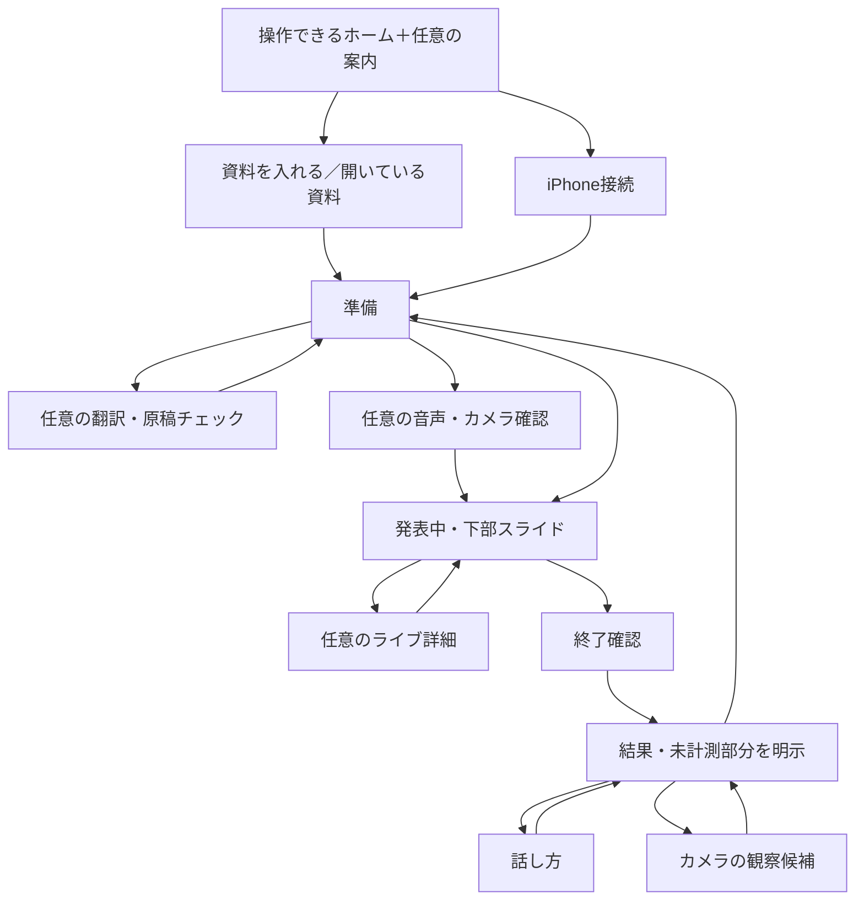
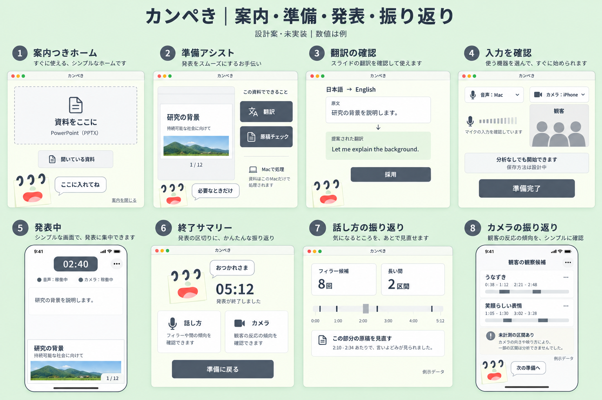

# キャラクター案内・翻訳・分析の画面設計（未実装）

実装状態の追記：カメラ部分は[CAMERA_ANALYSIS.md](CAMERA_ANALYSIS.md)に実装範囲を記録した。Mac/iPhoneの既存画面に入口と状態表示を追加し、B03/B05/R03/R05の補助パネルを接続した。笑顔らしい表情・音声・翻訳は引き続き未実装。下記の画像は企画画像のままである。

2026-09-15のユーザー依頼を反映。以下の機能を設計対象に加える。本番の実装開始・完成・精度検証を意味しない。SCREEN_FLOW.mdの左右タップ・指移動ポインター・下部スライドを維持し、本書で準備支援・分析・結果の範囲を拡張する。

## 迷わずメイン機能に到達する案内

最初から操作できるホームを出し、説明専用ページを何枚も通さない。ユーザー提供のノート型キャラクターが下部の案内スペースに小さく現れ、今できる操作へ目線・短い移動と吹き出しで誘導する。「資料をここに入れてね」「スマホをつなごう」「準備できたよ」の一言ずつ。クリックを強要する説明の連続にしない。

初回も「案内を閉じる」で即操作可能。再表示はヘルプから。完了した作業は飛ばし、戻っても完了フラグを保持する。2回目以降は案内を自動で繰り返さない。モーションを減らす設定では移動せず、静的な吹き出しだけにする。案内は通常の読み上げ経路でも伝える。

iPhoneではスライド直上の案内用余白をキャラクターの定位置とし、タップ領域・原稿・キーボードに重ねない。対象へ移動する演出は操作がない準備中だけ。発表開始後は原則隠し、発表者が要求したヘルプと重要な状態だけ表示する。ゲームらしさは伴走する案内と完了の小さな反応で表し、スコア・報酬・連続ログインは追加しない。

## スライドをつなぐ最短の流れ

MacホームでPPTXをドロップ、または「開いている資料を使う」を選ぶ → 対応する既存プレゼンアプリの表示を準備 → カンペきにスライドとノートを表示 → 接続済みiPhoneへ共有。
全画面表示を先に求めず、ユーザーが同じ資料を再選択するのを避ける。アプリの自動操作・表示用ウィンドウ識別は未検証の実装課題。特定できない場合だけサムネイルを見せて対象を確認する。権限不足/資料未対応の戻り先はSCREEN_FLOW.mdのE05/E06。
資料準備とiPhone接続はどちらを先に行ってもよい。翻訳・原稿分析の終了を待たずに基本の発表へ進める。接続・資料・任意の分析の準備状態を個別に示す。

## 準備時: MacのローカルLLM支援

処理場所はMacを想定し、iPhoneにモデル導入を要求しない。「ローカルLLM」は設計要件であり、macOS標準で対象モデルが使えるとは仮定しない。モデル・ライセンス・必要メモリ・対応言語・配布方式・速度は選定前。サポート外のMacでは分析なしで資料表示と発表に進める。

| ID / 状態 | 表示・操作 | 次の状態・戻り先 |
|---|---|---|
| A01 資料準備 | スライド＋原稿。任意操作「原稿を整える」。キャラクターが一度だけ案内 | A02またはそのまま発表準備 |
| A02 準備アシスト | 同じ画面のパネル内に「翻訳」「原稿チェック」の二択。分析対象はスライド本文/ノートの範囲を表示 | 翻訳→A03、チェック→A04、閉じる→A01 |
| A03 翻訳 | 原文と訳文、元言語/先言語、用語調整。「採用」「元に戻す」。長文はスクロール | 採用→アプリ内の原稿案へ保存。元PPTXの上書きはしない。戻る→A02 |
| A04 原稿チェック | 長さ・構成・曖昧な表現などの提案を優先順で少数提示。理由と対象箇所。推定所要時間は推定と明示 | 個別採用/編集/却下→A01。全部を自動適用しない |
| A05 モデル準備 | 導入が必要なら容量・提供元・端末条件を示し、人間の操作で導入開始。進行/取消 | 完了→依頼元。失敗/取消→分析なしで続ける。画面遷移だけでダウンロードしない |
| A06 分析中・失敗 | 進行表示と取消。エラーは短く、再試行/分析なしで進む | 古い資料の結果を新しい資料に適用しない。資料や原稿更新時は結果を再確認 |

解析結果は提案であり内容の正確さを保証しない。原文保持、変更の取り消し、数値/固有名詞/引用の確認を可能にする。クラウドへの自動フォールバックはしない。今回の設計では資料を外部に送らない。

## 本番前: 音声・カメラの準備

| ID / 状態 | 表示・操作 | 次の状態・戻り先 |
|---|---|---|
| B01 分析の準備 | 「音声」「カメラ」を任意設定として折りたたむ。未設定でも基本発表を開始できる | 音声→B02、カメラ→B03、開始→B04 |
| B02 音声入力確認 | MacかiPhoneのマイク1つを選択。短い入力レベル、言語、音声分析ON/OFF | 正常→B01。拒否/入力なし→設定へ/音声分析なしで続ける |
| B03 撮影範囲の確認 | Mac/iPhoneのカメラを選択。撮影範囲のプレビュー、対象が観客か発表者かを明示。iPhone固定時は前後カメラを選べる | 撮影への説明・必要な同意とOS許可の確認後→B01。分析OFFで続行可能 |
| B04 発表中 | 上部に残り時間・小さい音声/カメラ稼働表示。下部スライド。原稿は中央。キャラクターや数値の常時アニメーションなし | 詳細→B05。停止/終了は既存メニュー。時間終了は既存の振動 |
| B05 ライブ分析の詳細 | Macの補助パネル、iPhoneは任意のシート。フィラー候補と無音区間、カメラ解析状態。デフォルトで閉じる | 閉じる→B04。結果のためにスライド操作を隠す場合は明示して元に戻せる |

初期案は音声1入力・カメラ1入力を選択し、同時複数端末の重複計測を避ける。複数カメラの同時合成は未決定。Macカメラが発表者に向いている場合、観客の分析をしていると表示しない。iPhoneを発表者に向けた内カメラは発表者自身の表情の扱いになる。

## 音声の分析表示

フィラーは「えー」「あの」等の候補と時間位置を示し、誤検出を訂正できる。言語ごとに対象を変える。無音区間は開始/終了と長さを示し、意図的な間もあるため失敗と採点しない。閾値は例示で固定仕様ではない。
入力レベルがゼロでも、権限拒否・切断・マイク故障を「沈黙」と扱わない。信号の欠落は未計測区間として分ける。音声認識が遅い場合は解析中/結果遅延を表示する。発表中の検出ごとに音・振動・通知を出さず、標準は終了後の振り返りで確認する案。

## カメラ・表情の分析表示

ユーザーの求める表情分析は、顔の向き・うなずき・笑顔らしい表情など、映像上の観察候補を中心に設計する。感情、理解度、関心度を断定したり、個人を順位付けしたりしない。「笑顔だから理解した」という変換はしない。
観客は個人名や顔の一覧を出さず、時間帯別の集計を基本案とする。照明・距離・遮蔽で判別できない区間は解析不可/参考値として示し、ゼロ反応と区別する。発表者の自己分析と観客分析は混ぜない。
撮影してよい範囲、必要な同意、保存/共有の扱いを事前に確認する。初期案は生音声・映像を保存せず集計のみを端末内に保持するが、確定前。ローカルで処理するのは目標であり、モデル選定前に全分析の完全オフライン動作を保証しない。バックグラウンドでの撮影継続も保証しない。

## 終了後: 結果と改善

カメラ補助パネルの実装範囲と未接続項目は[RESULTS_DEVELOPMENT](../docs/RESULTS_DEVELOPMENT.md)を参照。統合された発表終了サマリーや音声結果が完成したことを意味しない。

| ID / 状態 | 表示・操作 | 次の状態・戻り先 |
|---|---|---|
| R01 終了サマリー | キャラクター「おつかれさま」。経過時間と改善の候補1つ。詳細は「話し方」「カメラ」の2分類 | 話し方→R02、カメラ→R03、準備へ→A01/既存準備画面 |
| R02 話し方 | フィラー候補数、長い間の区間、スライド別/時間軸の位置。データなし・未計測区間を明示 | 対象箇所の原稿を確認→A04案、戻る→R01。録音がなければ再生ボタンを出さない |
| R03 カメラ | 観客/発表者の対象表示、観察候補の時間帯別集計、判別できた範囲 | 戻る→R01。顔一覧、感情スコア、理解率は出さない |
| R04 結果を準備中 | 軽いサマリーを先に表示。詳細は解析中、取消可 | 完了→R01。待たずに準備へ戻れる。別セッションの結果と混ぜない |
| R05 未計測・失敗・削除 | 分析OFF/権限不足/入力断/解析失敗を区別し、可能な結果だけを表示。結果削除は確認後 | R01または準備。架空の0点や完了したグラフで埋めない |

iPhone結果は一度に少数の指標、Mac結果は同じデータを広く表示する。映像解析の初期実装は撮影端末内で処理する。Macが発表状態の基準となる案は維持し、集計結果の端末間同期は未接続。Slackへ結果や顔画像を自動送信しない。

## 遷移の全体像

本番開始後の検証: 案内スキップと再表示、分析未導入で発表まで到達、原稿変更の取消、音声なしと沈黙の区別、カメラ対象の誤表示防止、入力切断と背景復帰、結果準備中でも次の発表へ進めること。実装・精度・速度・端末対応は未検証。

## 画面案

内蔵ImageGenによる代表画面の企画画像。数値・人物・資料は例示。原稿チェックの詳細、モデル準備、入力障害、結果生成中等は上の画面表を参照する。画像の省略や細部より仕様書の状態遷移・取り消し操作を優先する。
