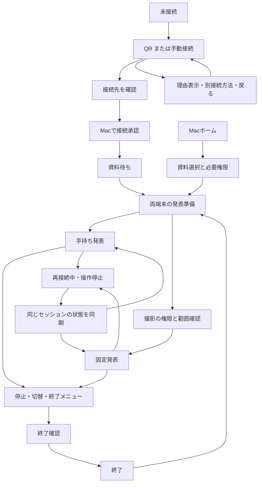
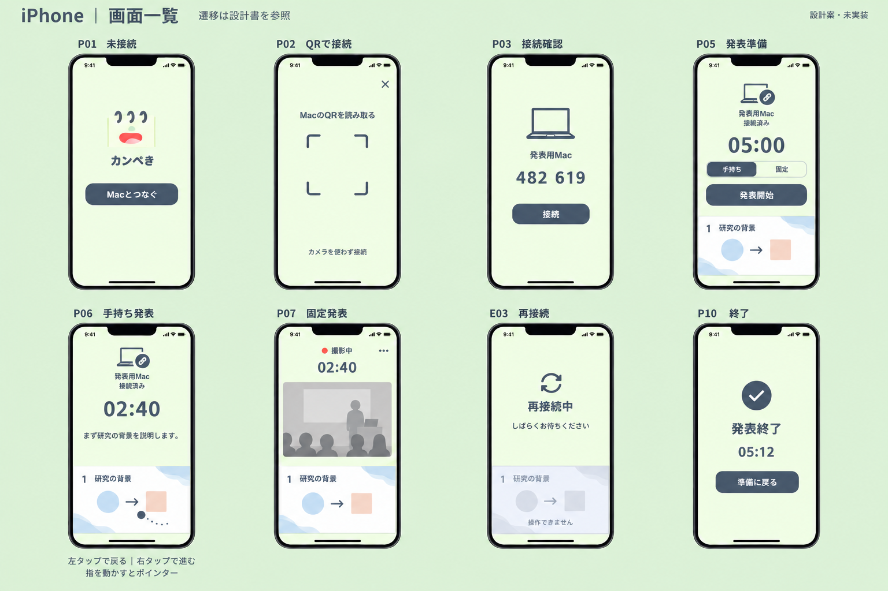
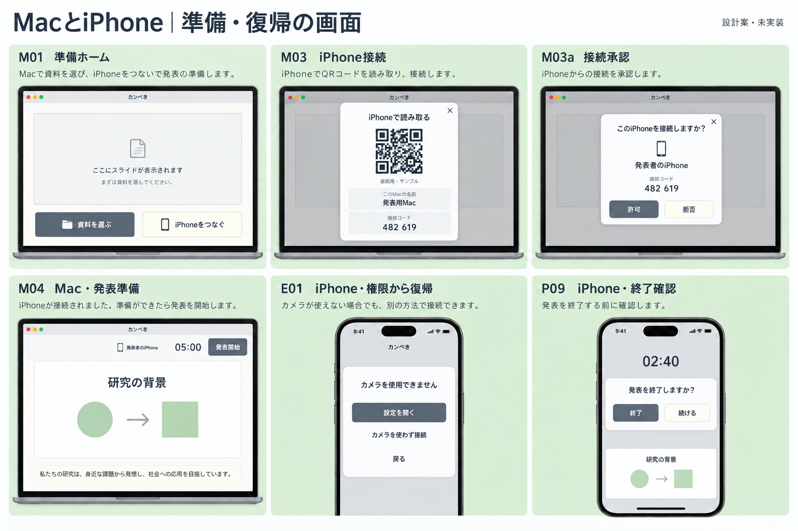

# 全画面遷移設計 v1（企画・未実装）

対象: 合意した最小構成における初回起動から終了まで。翻訳・音声・カメラ分析と結果画面はASSISTANCE_FLOW.mdで追加設計する。AI採点は合意事項に追加しない。ここにある接続手段、原稿表示、権限説明、時間管理の詳細は設計提案であり実装済み・実機検証済みではない。

## 確定した操作

- スライド送り専用の「次へ」「戻る」ボタンは置かない。
- iPhoneのスライドを画面下部に配置し、スライドの右半分の短いタップで1枚進み、左半分で1枚戻る。
- ページ変更は手動。Mac側で変更されたページは両端末へ反映する。
- 時間終了は振動で伝える。スライドは勝手に進めず、発表も強制終了しない。
- スライドへのタッチによるポインター操作を残す。

## 画面全体の配置

iPhoneは縦を初期案とし、上端に接続状態と残り時間、中央に必要なら原稿、下部にスライド。スライドを下の安全領域の直上に置き、下に別の操作バーを足さない。スライドの縦横比は原本を維持し、トリミング・縦引き伸ばしはしない。縦長資料と横長資料で余白が変わる。
通常時、左右半分の色分けや矢印をスライドに重ねない。初回だけ「左で戻る・右で進む」を表示し、操作後に消す。原稿のスクロールは中央だけで受け、スライドへのジェスチャーと混ぜない。文字拡大時も下部スライドを保持し、原稿はスクロールする。

ポインターは長押し不要で、指を動かすだけで操作する（ユーザー確定）。短いタップは指を離したときに判定し、指の移動を認識したらページ送り候補を取り消す。ポインター操作後に指を離しても送らない。手ぶれと意図的な移動を区別する移動閾値は実機で決める。長押しだけではポインターモードに切り替えず、短いタップ条件も満たさなければ何もしない。スライド外の余白、複数指、画面離脱はページ送りしない。認識前に通信が切れた操作も取り消す。
端のスライドではその方向のタップを無効にし、ループや自動終了をしない。連打は順序と重複を管理し、Macの確認済みページを表示する。画像取得が遅い間は古い画面を最新と表示しない。
VoiceOverではスライドに「次のスライド」「前のスライド」「ポインター」のカスタム操作を提供する案。左右タップだけを唯一の操作経路にはしない。端末を持てない場合はMacから操作する。

## iPhoneの画面と遷移

| ID / 画面 | 表示・主な操作 | 遷移と戻り先 |
|---|---|---|
| P01 未接続 | 小さなロゴ、「Macとつなぐ」の主操作。ログイン・チュートリアルカルーセルなし | 接続操作→P02。以前の相手が見つかればP03で確認。勝手に撮影しない |
| P02 QR読み取り | カメラ中央の読取枠。下に「カメラを使わず接続」。閉じる操作 | QR→P03。カメラ拒否→E01。手動→P02b。閉じる→P01 |
| P02b 手動接続 | 同じネットワーク上のMac一覧から選び、Mac表示の確認コードを入力する案 | 選択・入力→P03。見つからない→E02。戻る→P02。コードだけで任意のネットワーク越し接続を保証しない |
| P03 接続確認 | Mac名と短い照合情報、「接続」。接続中は同じ場所に進行表示 | Mac承認・接続成功→P04。拒否/期限切れ→E02。キャンセル→P01 |
| P04 接続済み・資料待ち | 接続先Mac名、「Macで資料を選んでください」。接続解除は補助メニュー | Macの資料準備完了→P05。Mac側処理中は待機表示。切断→E03 |
| P05 発表準備 | 上に時間設定、利用方法「手持ち／固定」、下にスライドプレビュー。主操作は「発表開始」 | 手持ち→P06。固定→P05c。資料・権限未準備なら開始不可で理由表示。ページ操作は発表開始前には送らない |
| P05c カメラ準備 | 上部に小さい撮影プレビュー、向き/使用カメラの確認、下部スライド。「撮影して開始」 | 権限と撮影準備成功→P07。拒否→E01。戻る→P05、手持ちに切替可能 |
| P06 手持ち発表 | 残り時間、任意の原稿、下部に直接操作するスライド。小さな補助メニュー | 左右タップ→同画面のページ更新。時間終了→P06の終了時間表示＋振動。補助メニュー→P08。切断→E03 |
| P07 固定発表 | 上に撮影中の明示と必要最小限のプレビュー、残り時間。下部スライドは同じ直接操作 | ページはMacからも変更可能。撮影停止→撮影なしの同画面。補助メニュー→P08。権限喪失/バックグラウンド→E04 |
| P08 発表中メニュー | 小さいシートに「一時停止／再開」「使い方の切替」「発表を終了」。破壊的操作を近接させない | 閉じる→P06/P07。停止中も手動ページ操作可。終了→P09確認。モード切替は撮影状態を明示 |
| P09 終了確認 | 「発表を終了しますか？」、終了/続ける | 終了→P10、続ける→直前画面。タイマーは確認表示だけでは止めない |
| P10 終了 | 発表終了、経過時間。「準備に戻る」が主操作。架空のAIスコアや分析結果を表示しない | 戻る→P05（時間は設定値に戻す）。資料解除済み→P04。接続解除→P01 |

原稿はPPTXノートを取得できる場合だけ表示する案。ノートがなければ中央は余白にし、AI生成文や警告で埋めない。
固定カメラの撮影対象・保存有無の詳細はASSISTANCE_FLOW.mdを参照する。P05c/P07は分析を有効にしたときの画面案であり、録画・分析機能の完成を意味しない。画像の赤い撮影表示はOSの表示とは別のアプリ内状態案。

## Macの画面と遷移

| ID / 画面 | 表示・主な操作 | 遷移と戻り先 |
|---|---|---|
| M01 準備ホーム | 資料領域「資料を選ぶ」、接続領域「iPhoneをつなぐ」。両方の準備を同一画面で進められる | 資料→M02。接続→M03。片方だけ完了しても失わない |
| M02 資料選択・読み込み | OSのファイル選択でPPTXを指定。読み込み中、資料名と進捗。キャンセル可能 | 対応アプリ選択/起動、ノート読取、必要権限→E05/M04。失敗→E06。閉じる→元画面 |
| M03 iPhone接続シート | 接続先名、期限付きQR、手動接続用コード。閉じる操作 | iPhone申請→M03a。QR更新は同シート。閉じる→元画面 |
| M03a 接続承認 | 申請端末名・照合情報、許可/拒否。端末名だけを本人確認にしない | 許可→元画面の接続状態更新、iPhone P04/P05。拒否→待受継続 |
| M04 発表準備 | 大きいスライド、取得できた原稿、時間設定、iPhone接続状態。主操作「発表開始」 | 準備完了→M05とiPhone P06/P07。iPhone未接続ならMacだけで開始する選択肢を明示。資料変更→M02 |
| M05 発表中 | スライド中心、控えめな残り時間、原稿。必要なら別ウィンドウで観客向け出力 | iPhone/既存プレゼンアプリの手動操作→同画面更新。メニュー停止/終了→M06。切断は状態表示だけで発表継続 |
| M06 終了確認・終了 | 確認後、撮影/キャプチャ・ポインター・タイマーのセッションを停止。終了時間を表示 | 準備へ→M04。資料閉じる→M01。iPhoneにも終了状態を同期 |

Macの発表者画面と観客向け投影を区別する。原稿・接続コード・管理メニューを観客向け出力に載せない。投影/ミラーリング環境は実機確認が必要。
同時に接続する操作用iPhoneは1台を初期案とし、別端末の接続時は既存接続の置換確認を求める。撮影用の別端末同時接続は最小構成の外。

## 例外・権限・復旧（独立した行き止まりを作らない）

| ID / 状態 | 見せる内容・操作 | 復帰とデータの扱い |
|---|---|---|
| E01 iPhoneカメラ/ローカルネットワーク権限拒否 | 必要になった場面で目的を説明してOS許可を求める。拒否後は設定を開く/戻る。QR用カメラなら手動接続も表示 | 元のP02/P05cへ戻す。固定撮影が不可でも手持ちは選べる。ネットワーク権限不可なら未接続状態へ |
| E02 Mac未発見、QR不正/期限切れ、接続拒否 | 状況に合う短い説明、再試行、手動接続/QR再表示 | 発表データは削除しない。到達できないネットワークではQRでも接続不可と伝える |
| E03 発表中の通信切断・画像停止 | iPhoneに「再接続中」。最後の画像は古い表示と区別し、操作送信を停止。Mac側発表は継続 | 同一セッションに再接続し、現在ページ/タイマー/撮影状態をMacから取得。切断中のタップを再送しない。Mac再起動/別資料は再確認してP04/P05へ |
| E04 iPhoneロック/背景移行/アプリ終了、カメラ停止 | 復帰時にカメラ状態と接続状態を再確認。撮影停止を明示 | 撮影再開は人間の操作。タイマーは経過時間から復元。背景でも必ず振動・撮影が続くとは保証しない |
| E05 Mac画面収録・操作権限不足 | 必要な権限ごとに短い目的、システム設定へ、再確認。不要な権限は求めない | 設定後は元の資料へ戻す。再起動必要なら資料選択状態を復元し、発表を勝手に開始しない |
| E06 資料不正/未対応/アプリ未導入/スライドなし | 原因と「別の資料を選ぶ」または対応アプリを開く操作 | 元の有効資料があれば保持。ノートなしはエラーにしない。Canva/Keynote等は対応済みと表示しない |
| E07 発表アプリ終了・資料変更・キャプチャ対象消失 | 両端末に「資料を確認してください」、操作とポインター停止 | 時間は継続して明示的に停止可能。資料を選び直し、時間継続/新規開始を確認する |
| E08 残り時間ゼロ | 手持ちは振動＋短い終了表示、固定は画面表示も使う | 発表とページ操作を維持。初期案は振動1回。繰り返し通知はしない |
| E09 音声支援・文字拡大・横向き | 読み上げ用の操作名を用意。文字拡大で原稿がスライドを押し出さない | 向きの変更はページ/時間を保持し進行中ジェスチャー取消。横向きの厳密配置は次のレビュー対象 |

QRは接続先の識別情報と短寿命の接続要求に使う案。秘密鍵や永続トークンを載せない。通信方式・同一ネットワーク到達性・暗号化/ペアリング実装は本番開始後に検証する。アカウント登録やクラウド中継は最小構成に追加しない。

## 両端末で共有する状態の設計

セッション、資料、現在ページ、発表中/停止中/終了、設定時間と開始基準、接続確認、撮影の稼働状態を区別する。Macを発表状態の基準にする案。開始/停止/終了はどちらで操作しても一度だけ反映し、再接続時に二重開始や時間リセットを起こさない。
タイマーは既定の時間を勝手に合意済みにしない。画像の02:40は例示。両端末の時計ずれは単調な経過時間と同期で扱う設計課題。

## 遷移図

## 本番開始後の受け入れ確認

1. 初めての両端末で、資料選択→接続と接続→資料選択の両順序を完走する。
2. カメラ拒否でも手動接続から手持ち発表まで進める。権限不足は復帰先を失わない。
3. 下部スライドの左右タップで1枚ずつ変わり、ポインター操作・指離し・余白・縦スクロールでは誤送信しない。
4. 発表中にWi-Fi断・アプリ背景化・Mac側ページ変更が起きても、復帰時に現在状態へ収束する。
5. 先頭/末尾、時間ゼロ、一時停止、終了取消と終了確定を確認する。
6. 固定時は撮影状態を誤表示せず、カメラ停止後の無断再開をしない。
7. 文字拡大・VoiceOver・各端末サイズで、画面下部のスライド操作と終了経路に到達できる。

未検証: 全ての動作。現在は設計資料のみ。図は全例外の個別分岐を省略しているため、画面表・例外表を正本とする。

## 企画画像

代表画面の一覧。線や文字・ロゴの細部は生成画像のため、実装時の正確な表示はBRAND.mdと原本を参照する。画像は全遷移の代わりではなく、上の画面表・例外表を併用する。

キャラクター案内、準備の翻訳/原稿分析、音声/カメラ入力、ライブ分析、終了結果は[ASSISTANCE_FLOW.md](ASSISTANCE_FLOW.md)で拡張する。P10は分析なしの簡易終了、分析ありはR01/R04へ進む。
